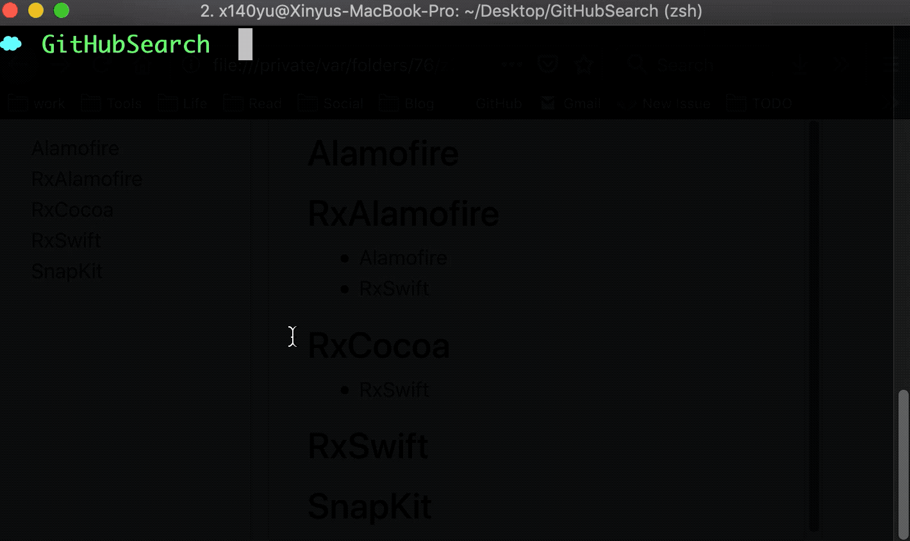

# Cocoapods Dependency

[](https://travis-ci.org/X140Yu/cocoapods-dependency)
[](https://coveralls.io/github/X140Yu/cocoapods-dependency?branch=master)
[](https://badge.fury.io/rb/cocoapods-dependency)


A CocoaPods plugin which analyzes the dependencies of any cocoapods projects. Subspecs are properly handled.



## [中文说明](https://zhaoxinyu.me/2018-08-20-analyze-pods-dependecy/)

## Installation

    $ gem install cocoapods-dependency

## Usage

The command should be executed in directory that contains podfile.

```shell
# put the analyze result to console
$ pod dependency

# write te analyze result to a readable HTML
$ pod dependency --visual
```

## Why this gem?

Suppose you have a project with a simple dependency,

```ruby podfile
target 'Test' do
  pod 'Texture', '2.7'
end
```

It seems like this project has just a single dependency, but behind this pod, it may depend on several other pods and these other pods may also depend on some other pods as well 🤦🏻‍♂️, it's hard to determine what the exactly dependency situation of the project with just a glance of the podfile. So I wrote this it to do this thing.

- ✅ It can print all the dependencies
- ✅ Each dependecy's dependencies can also be printed
- ✅ Subspecs are properly handled, `pod 'Texture', '2.7'` and `pod 'Texture', '2.7', subspecs: %w[PINRemoteImage IGListKit Yoga]` will lead to different results

## TODO

- [X] Lift it to a cocoapods-plugin
- [X] Pretty printed result

## License

The gem is available as open source under the terms of the [MIT License](https://opensource.org/licenses/MIT).
